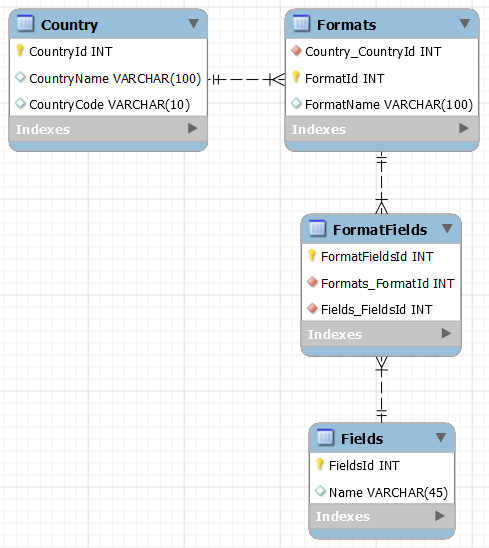

# Global Address Formatter

By: Thomas Bakken, Stella Marie, Allie Zhao

## Technologies Used
- C# 12
- ASP.NET Core 7
  - EntityFrameworkCore (API)
  - MySQL
  - RestSharp
  - Newtonsoft.Json

## Description

GlobalAddressFormatter is a web app and api for formatting postal addresses for sending mail and packages abroad. Anyone can use the form to format addresses.

### Samples

Format Link: https://en.wikipedia.org/wiki/Address
Format Link: http://www.columbia.edu/~fdc/postal/

Australia
-
Bangladesh
-
Chile
-
Greece
-
India
-
United States
-

### Web Client
Port: http://localhost:5000/


- Home(Index): Form
  - Select country -> retrieve address format
  - View format information: address formats
  - Add fields to enter destination address -> format an address

Appearance:
Select a Country: ______________________________ > API request

* Once api call returns list
| FormatName        | Format (Pattern)          | Description               |
| ----------------- | ------------------------- | ------------------------- |
| {format_name}     | {format_pattern}          | What distinguishes format |

* Once list of formats renders
Select a Format: ________________________________ >

* Once a format is selected => render input fields
FieldName: __________
FieldName: __________

**Sample Request**
Method: GET
URL: http://localhost:6000/formats?country={country}
Action: Returns list of formats.

### Web Api
- ApiController: Countries ```.../countries```
- ApiController: Formats ```.../formats```

| Method    | URL format        | Action                    |
| --------- | ----------------- | ------------------------- |
| GET       | .../countries     | Returns list of countries |
| GET       | .../formats       | Returns list of formats   |

**Queries for: .../formats?**

Parameter: country (country name || countrycode)
Required - Returns list of address formats by country

**Sample Response: /countries**
```json
{
    "countries": [
        { "country_code" : "country_name" }
    ]
}
```

**Sample Response: .../formats?**
```json
{
    "formats": {
        "format_name": {
            "format_pattern" : "{pattern}",
            "fields": [
                "field_name"
            ]
        }
    }
}
```

### Database
Database: Countries > Formats <> FormatFields <> Fields

Tables:
- Countries: Id, FullName, CountryCode
- Formats: Id, CountryId, Name
- FormatFields: Id, FormatId, FieldId
- Fields: Id, Name

Minimal Viable Product Database:


Additional Features Database:


### Yellow Features / Could Have (if there's time)
- Deploy on Azure
- Add field types
- Add valid inputs for each field

### Red Features / Won't Have (this time)
- Global address book

## Complete Setup
